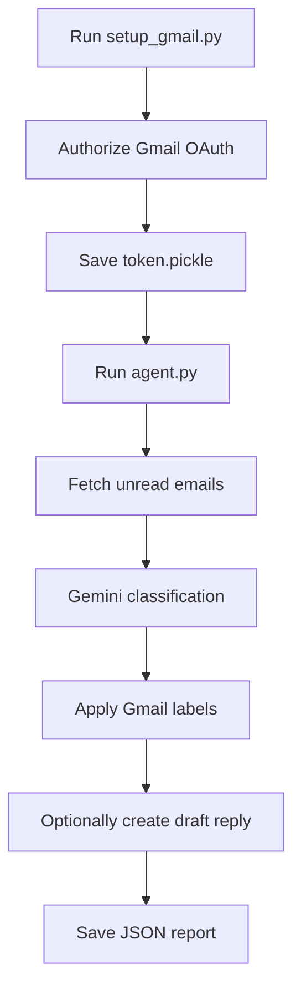

# Email Triage Agent using Gmail API

## 📌 Overview

This project implements an **AI-powered email triage agent** in Python. It connects to a Gmail account, reads unread emails, classifies them with **Google Gemini**, applies color-coded Gmail labels, optionally drafts replies, and saves a JSON report for each run.

The workflow is split into two scripts:

* `setup_gmail.py` for one-time Gmail OAuth authorization
* `agent.py` for the main triage and automation loop

---

## 🚀 Setup (5 steps)

### Step 1 — Install Python dependencies

This project targets Python 3.13+ and uses the packages listed in `pyproject.toml`.

```bash
pip install google-api-python-client google-auth google-auth-httplib2 google-auth-oauthlib google-genai
```

### Step 2 — Add your Gemini API key

Create a local `.env` file and add:

```env
GEMINI_API_KEY=your_key_here
```

Optional values such as `GEMINI_MODEL`, `MAX_EMAILS`, and `SKIP_DRAFT_CREATION` can also be added here.

### Step 3 — Add Gmail OAuth credentials

1. Create or open a Google Cloud project
2. Enable the **Gmail API**
3. Create an **OAuth Client ID** for a desktop app
4. Download the JSON file and save it as `credentials.json` in this folder

### Step 4 — Authorize Gmail access

```bash
python setup_gmail.py
```

This opens a browser sign-in flow and saves `token.pickle` for later runs.

### Step 5 — Run the triage agent

```bash
python agent.py
```

## ⚙️ Architecture

### 1. Gmail Authorization Pipeline

1. **Google OAuth Credentials**

   * Loads `credentials.json` from the project folder
   * Uses Gmail OAuth scopes for read, label, modify, and compose access

2. **OAuth Setup Script**

   * Runs `setup_gmail.py`
   * Opens a browser-based Google sign-in flow
   * Saves the authorized token to `token.pickle` by default

3. **Token Reuse**

   * Reuses the saved token on later runs
   * Refreshes credentials automatically when possible

---

### 2. Email Triage Pipeline

1. **Fetch Unread Emails**

   * Reads unread messages from the Gmail inbox
   * Limits processing with `MAX_EMAILS`

2. **Gemini Classification**

   * Sends sender, subject, date, and message body/snippet to Gemini
   * Returns structured JSON with priority, category, summary, and reply intent

3. **Label Application**

   * Creates Gmail labels if they do not already exist
   * Applies one of: `AI/Urgent`, `AI/Important`, `AI/Normal`, `AI/Low`

4. **Draft Reply Creation**

   * Generates a short professional reply for low/normal emails that need a response
   * Can be disabled with `SKIP_DRAFT_CREATION=true`

5. **Report Generation**

   * Prints a triage summary to the console
   * Saves a JSON report in the `reports/` folder

---

## 🔄 Workflow Summary



---

## 🧠 Features

* ✅ One-time Gmail OAuth setup with token reuse
* ✅ Gemini-based email prioritization and categorization
* ✅ Color-coded Gmail labels for triaged emails
* ✅ Optional AI-generated draft replies
* ✅ Console triage summary with urgent/important highlights
* ✅ JSON report output for audit and review
* ✅ Configurable via environment variables

---

## 🔑 Requirements

### Accounts & APIs

* Google Cloud project
* Gmail API enabled
* Google Gemini API key

### Python Dependencies

* `google-api-python-client`
* `google-auth`
* `google-auth-httplib2`
* `google-auth-oauthlib`
* `google-genai`

### Files Required in the Project Folder

* `credentials.json` for Gmail OAuth
* `.env` for local configuration

---

## 📂 Configuration Details

### Gemini

* `GEMINI_API_KEY` - Gemini API key used by the agent
* `GEMINI_MODEL` - primary model name, default: `gemini-1.5-flash-latest`
* Fallback models are tried automatically if the configured model is unavailable

### Gmail OAuth

* `CREDS_FILE` - OAuth client file, default: `credentials.json`
* `TOKEN_FILE` - saved authorized token, default: `token.pickle`
* `OAUTH_REDIRECT_PORT` - local callback port, default: `8080`
* `OAUTH_LOCAL_SERVER_TIMEOUT` - timeout for browser callback flow

### Triage Behavior

* `MAX_EMAILS` - maximum unread emails to process, default: `20`
* `SKIP_DRAFT_CREATION` - disables draft creation when set to `true`
* `REPORTS_DIR` - folder used for saved JSON reports, default: `reports`
* `API_REQUEST_DELAY` - delay between Gemini requests to avoid rate spikes

### Gmail Labels

* `urgent` → `AI/Urgent`
* `important` → `AI/Important`
* `normal` → `AI/Normal`
* `low` → `AI/Low`

---

## ⚠️ Known Issues & Notes

* Ensure the Gmail API is enabled in the same Google Cloud project as the OAuth client in `credentials.json`
* If Gmail returns `accessNotConfigured`, wait a few minutes after enabling the API and try again
* If Gemini returns a quota error, check API usage and billing in Google AI Studio
* Keep the prompt output as valid JSON, because the agent parses it directly with `json.loads()`
* Draft replies are only generated for emails classified as `low` or `normal` when `needs_reply` is true

---

## 🚀 How to Use

1. Add your Google OAuth client file as `credentials.json`
2. Create a `.env` file with `GEMINI_API_KEY=...`
3. Run `python setup_gmail.py` once to authorize Gmail access
4. Run `python agent.py` to triage unread emails
5. Review the console output, Gmail labels, draft replies, and saved JSON report

---

## 📈 Future Improvements

* Add richer email parsing for HTML-heavy messages
* Add per-sender or per-label filtering before classification
* Store reports in a database instead of flat JSON files
* Add a lightweight UI for reviewing triage results
* Add scheduled execution for recurring inbox processing

---

## 🏷️ Tags

`Email Triage` `Gmail API` `Google Gemini` `Automation` `AI Agent` `Python` `OAuth` `Productivity`

---

## 👤 Author

Puvanakopis
